# Team Predictive Pioneers

## STAGE 1 Homework EDA


## 1. Descriptive Statistics

### Import Dataset

Download dataset [here](https://www.kaggle.com/datasets/adammaus/predicting-churn-for-bank-customers/)

Source code :

```code
import pandas as pd
```

### Load the dataset
```code
df = pd.read_csv('Churn_Modelling.csv')
```

### Menampilkan 5 baris pertama dari dataframe
```code
df.head()
```

Berdasarkan tampilan awal dari dataset tersebut, kita memiliki informasi tentang beberapa pelanggan dari sebuah bank dan apakah mereka telah keluar (churn) dari bank tersebut. Beberapa fitur yang ada antara lain:

- **RowNumber** : Nomor baris
- **CustomerId** : ID pelanggan
- **Surname** : Nama belakang pelanggan
- **CreditScore** : Skor kredit pelanggan
- **Geography** : Negara asal pelanggan
- **Gender** : Jenis kelamin pelanggan
- **Age** : Usia pelanggan
- **Tenure** : Durasi pelanggan telah menjadi anggota bank
- **Balance** : Saldo akun pelanggan
- **NumOfProducts** : Jumlah produk yang dimiliki pelanggan di bank
- **HasCrCard** : Apakah pelanggan memiliki kartu kredit
- **IsActiveMember** : Apakah pelanggan aktif
- **EstimatedSalary** : Gaji yang diperkirakan
- **Exited** : Apakah pelanggan telah keluar dari bank (1 berarti ya, 0 berarti tidak)

Dari fitur-fitur di atas, RowNumber, CustomerId, dan Surname sepertinya tidak relevan untuk analisis korelasi karena mereka adalah identifikasi unik pelanggan dan tidak memberikan informasi substansial tentang perilaku pelanggan.

Berikut merupakan info dari dataset
```code
<class 'pandas.core.frame.DataFrame'>
RangeIndex: 10000 entries, 0 to 9999
Data columns (total 14 columns):
 #   Column           Non-Null Count  Dtype  
---  ------           --------------  -----  
 0   RowNumber        10000 non-null  int64  
 1   CustomerId       10000 non-null  int64  
 2   Surname          10000 non-null  object 
 3   CreditScore      10000 non-null  int64  
 4   Geography        10000 non-null  object 
 5   Gender           10000 non-null  object 
 6   Age              10000 non-null  int64  
 7   Tenure           10000 non-null  int64  
 8   Balance          10000 non-null  float64
 9   NumOfProducts    10000 non-null  int64  
 10  HasCrCard        10000 non-null  int64  
 11  IsActiveMember   10000 non-null  int64  
 12  EstimatedSalary  10000 non-null  float64
 13  Exited           10000 non-null  int64  
dtypes: float64(2), int64(9), object(3)
memory usage: 1.1+ MB
```

Selanjutnya kita akan menganalisa kolom numerical 

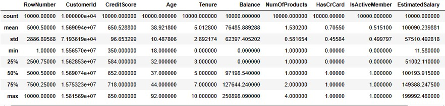

Selanjutnya kita akan menganalisa kolom categorical

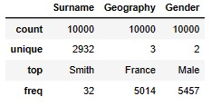

- Apakah ada kolom dengan tipe data kurang sesuai, atau nama kolom dan isinya kurang sesuai?
   
untuk A semua tipe data sudah sesuai. dapat dilihat dari keterkaitan type data dengan nilai dari setiap kolom.
   
- Apakah ada kolom yang memiliki nilai kosong? Jika ada, apa saja? 

untuk B tidak ada kolom yang memiliki nilai kosong
   
- Apakah ada kolom yang memiliki nilai summary agak aneh? (min/mean/median/max/unique/top/freq) 

untuk C analisa pada atribut numerical khususnya pada nilai kolom 'EstimatedSalary' dan 'Balance' memiliki selisih yang   terlampau jauh dari nilai rata-rata. Dapat dikatakan bahwa kedua kolom tersebut tidak terdistribusi normal.
   
lalu pada analisa kolom categorical tidak ada yang anomali/mencurigakan, semua nilai nya masih normal.


### 2. Univariate Analysis

**#Distribusi kolom Numerik dengan boxplot**
```code
plt.figure(figsize=(15, 5))
for i in range(0, len(nums)):
    plt.subplot(1, len(nums), i+1)
    sns.boxplot(y=df[nums[i]], color='gray', orient='v')
    plt.tight_layout()
plt.show()
```
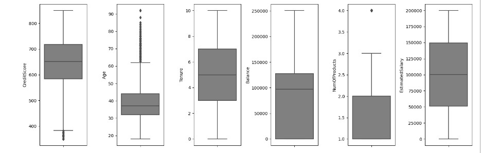

Kolom age memiliki outlier yang cukup banyak terlihat pada boxplot sehingga nilai ini cukup berpengaruh jika digunakan dalam analisis


**#Distribusi kolom Numerik dengan histplot**
```code
plt.figure(figsize=(12, 5))
for i in range(0, len(nums)):
    plt.subplot(2, len(nums), i+1)
    sns.histplot(df[nums[i]], kde=True, color='gray')
    plt.tight_layout()
```

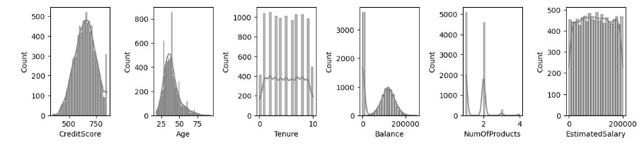

Pada distribusi plot dari keenam variabel, didapatkan variabel age berskew positif. untuk balance dan num of product terdapat 2 puncak atau bimodal. Selain itu untuk estimated salary dan tenure cenderung stasioner di nilai-nilai tertentu.

**Analisa kolom categoric serta kolom yang berisikan nilai boolean terhadap label**
```code
cats = ['Geography', 'Gender','HasCrCard','IsActiveMember','Exited']

for i in range(5):  # Perulangan sebanyak 5 kali
    plt.subplot(2, 3, i+1)
    sns.countplot(data=df, x=cats[i], color='red', orient='h', hue='Exited')
    plt.xticks(rotation=20)
    plt.tight_layout()

plt.show()
```
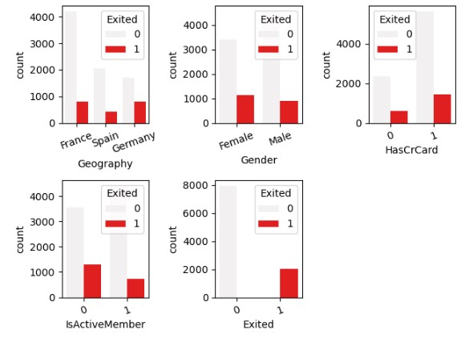

Pada hasil countplot di atas, dapat dilihat bahwa nasabah yang masuk kategori Geography:France berjumlah 5014 orang, untuk Geography:Spain berjumlah 2509 berjumlah, dan untuk Geography:Germany berjumlah 2477 orang.

Pada hasil countplot di atas, dapat dilihat bahwa nasabah yang masuk kategori Gender:Male berjumlah 5457, sedangkan untuk Female juga berjumlah 5453 orang.

Pada hasil countplot di atas, dapat dilihat bahwa nasabah yang memiliki credit card berjumlah 7055 orang, sedangkan untuk yang tidak memiliki cr card berjumlah 2945 orang.

Pada hasil countplot di atas, dapat dilihat bahwa nasabah yang masih aktif berjumlah 5151 orang, sedangkan untuk yang tidak aktif berjumlah 4849 orang.

Pada hasil countplot di atas, dapat dilihat bahwa nasabah yang melakukan churn berjumlah 7963 orang, sedangkan untuk yang tidak churn berjumlah 2037 orang.


Follow up Pre-Processing : 

Skewness pada Variabel Age (Positif): Untuk menangani skewness positif, Anda dapat mempertimbangkan transformasi data seperti log-transform, atau menggunakan metode lain yang sesuai untuk mengubah distribusi menjadi lebih mendekati distribusi normal. Hal ini dapat membantu dalam meningkatkan kinerja beberapa model machine learning yang sensitif terhadap asumsi distribusi normal.

Bimodal pada Variabel Balance dan Num of Product: Keberadaan dua puncak pada distribusi (disebut bimodal) pada variabel Balance dan Num of Product menunjukkan adanya dua kelompok yang mungkin memiliki karakteristik yang berbeda. kita perlu memutuskan apakah ingin memperlakukan keduanya sebagai kelompok terpisah atau mencoba menggabungkannya menjadi satu kelompok tergantung pada tujuan analisis.

Variabel Estimated Salary dan Tenure Stasioner di Nilai Tertentu: Jika variabel Estimated Salary dan Tenure cenderung stasioner di nilai-nilai tertentu, ini bisa menjadi indikasi bahwa ada beberapa "titik potong" di mana distribusi berubah.


### 3. Multivariate Analysis
**Pertama, kita akan melihat korelasi antara masing-masing fitur dengan label (Exited).**

```code
import matplotlib.pyplot as plt
import seaborn as sns
```

#Drop non-relevant columns for the correlation analysis
```code
df_corr = df.drop(columns=['RowNumber', 'CustomerId', 'Surname'])
```

#Compute the correlation with the 'Exited' column
```code
correlation_with_label = df_corr.corr()['Exited'].sort_values(ascending=False)
```

#Plot the correlation with the 'Exited' column
```code
plt.figure(figsize=(10, 6))
sns.barplot(x=correlation_with_label.values, y=correlation_with_label.index)
plt.title('Correlation with Exited label')
plt.xlabel('Correlation Coefficient')
plt.show()
```

**correlation_with_label**

**Hasil nya:**

```code
RESULTE
Exited             1.000000
Age                0.285323
Balance            0.118533
EstimatedSalary    0.012097
HasCrCard         -0.007138
Tenure            -0.014001
CreditScore       -0.027094
NumOfProducts     -0.047820
IsActiveMember    -0.156128
Name: Exited, dtype: float64
```

**Grafik nya:**

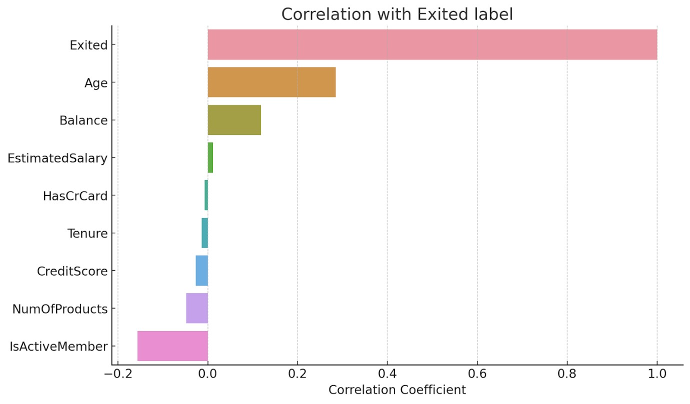

Berdasarkan grafik dan tabel korelasi di atas:

**Korelasi antara masing-masing fitur dengan label (Exited):**

- Age memiliki korelasi positif yang paling kuat dengan Exited, yang berarti pelanggan yang lebih tua cenderung memiliki kemungkinan lebih tinggi untuk keluar.
- Balance juga memiliki korelasi positif dengan Exited, meskipun tidak sekuat Age.
- IsActiveMember memiliki korelasi negatif terkuat dengan Exited, menunjukkan bahwa anggota yang aktif memiliki kemungkinan lebih rendah untuk keluar.
- Fitur-fitur lain seperti EstimatedSalary, HasCrCard, Tenure, CreditScore, dan NumOfProducts memiliki korelasi yang relatif lemah dengan Exited.

**Rekomendasi fitur yang harus dipertahankan berdasarkan relevansinya dengan Exited:**

- Age, Balance, dan IsActiveMember tampaknya merupakan fitur yang paling relevan berdasarkan korelasinya dengan Exited dan harus dipertahankan.
- Meskipun fitur lain memiliki korelasi yang lebih rendah, mereka mungkin tetap berguna tergantung pada model yang kita gunakan dan pertimbangan lain seperti interpretasi bisnis.

**Kemudian, kita akan melihat korelasi antar fitur.**

#Compute the correlation matrix
```code
correlation_matrix = df_corr.corr()
```

#Plot the correlation heatmap
```code
plt.figure(figsize=(12, 8))
sns.heatmap(correlation_matrix, annot=True, cmap='coolwarm', vmin=-1, vmax=1)
plt.title('Correlation Heatmap')
plt.show()
```

**Grafik nya:**

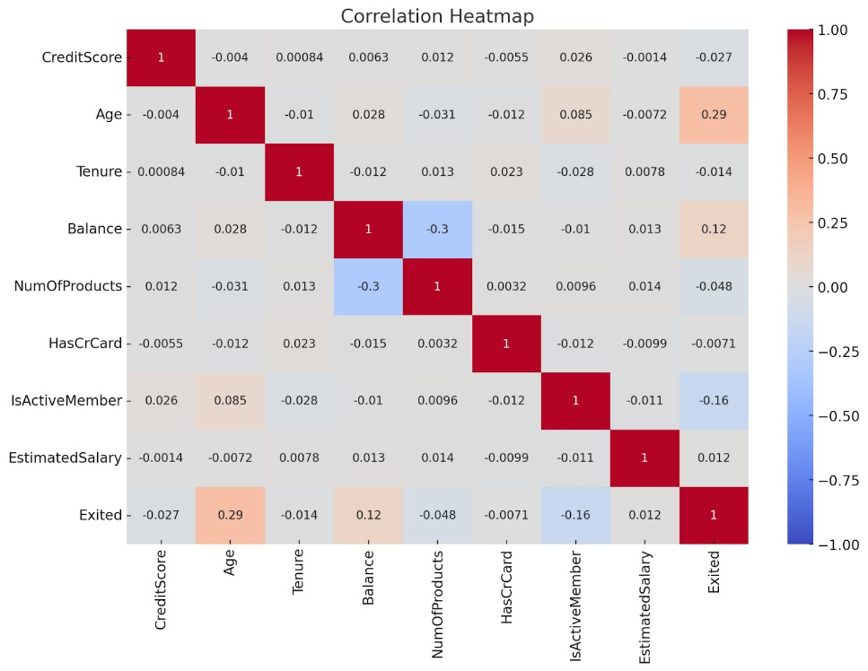

Berdasarkan heatmap korelasi antar-fitur:

Observasi:
- Tidak ada dua fitur yang memiliki korelasi yang sangat kuat satu sama lain.
- Sebagian besar fitur memiliki korelasi yang lemah atau sedang dengan fitur lainnya.
- NumOfProducts memiliki korelasi negatif dengan Balance. Meskipun korelasinya tidak terlalu kuat, ini dapat menunjukkan bahwa pelanggan dengan lebih banyak produk cenderung memiliki saldo yang lebih rendah. Ini mungkin karena beberapa produk bank tidak memerlukan saldo yang tinggi atau pelanggan dengan banyak produk memanfaatkan layanan lain yang tidak memerlukan saldo yang besar.

Rekomendasi:
- Tidak ada fitur yang memiliki korelasi yang sangat kuat sehingga tidak perlu ada tindakan khusus seperti menghapus salah satu dari dua fitur yang berkorelasi.
- Selanjutnya, kita mungkin ingin mempertimbangkan analisis lebih lanjut atau pemodelan untuk mengekstrak informasi lebih lanjut dari fitur-fitur ini.

Lalu kami juga menganalisa 2 categorical kolom terhadap label ‘Exited’ yaitu kolom ‘Geography’ dan ‘Gender’.

Source code : 

#memisahkan kolom ke dalam categorical
```code
df_cat = df[['Surname','Geography', 'Gender','Exited']]
sns.histplot(data=df_cat, x=df_cat['Geography'], hue=df_cat['Exited'])
plt.title('Geography vs Exited')
plt.ylabel('Sum of Exited')
```

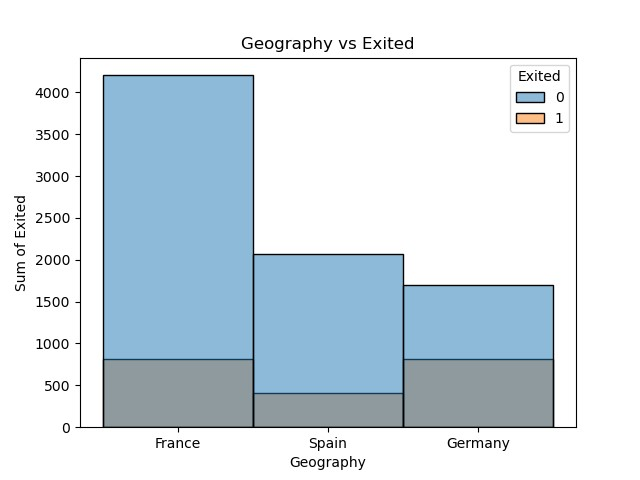

**Insight :**
Berdasarkan analisa menggunakan kolom Geography, kami mendapatkan bahwa negara germany memiliki tingkat yang berpotensi churn terbanyak diantara kedua negara lainnya. Oleh karena itu, perlunya action yang harus dilakukan terhadap negara tersebut agar pelanggan dapat betah dengan product yang ditawarkan.

Source code : 
```code
sns.histplot(data=df_cat, x=df_cat['Gender'], hue=df_cat['Exited'])
plt.title('Gender vs Exited')
plt.ylabel('Sum of Exited')
```

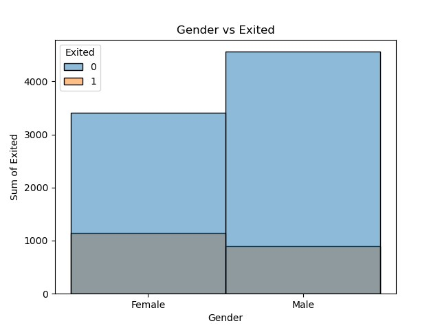

**Insight :**
Berdasarkan analisa menggunakan kolom Gender, didapatkan bahwa pelanggan dengan jenis kelamin female lebih berpotensi untuk melakukan churn daripada laki-laki. Oleh karna itu, bank harus lebih memberikan banyak tindakan terhadap nasabah perempuan agar tetap menjadi nasabah pada bank tersebut.


### 4. Business Insight

Source code : 

Import dataframe ‘Bank Churn’ menjadi variable ‘data’

**#Membuat plot distribusi EstimatedSalary**
```code
import plotly.express as px
fig = px.histogram(data, x="EstimatedSalary", y='Exited', nbins=30, title="Distribusi EstimatedSalary terhadap tingkat churn")
fig.show()
```
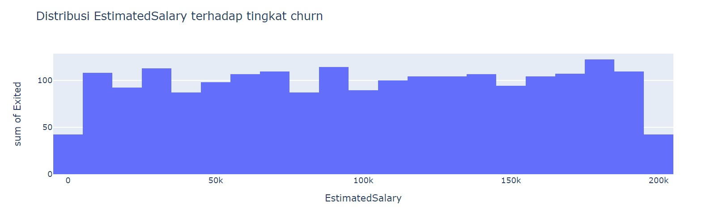

**Hasil analisis :** EstimatedSalary atau jumlah pendapatan **tidak memiliki pengaruh** terhadap churn, hal ini dapat dilihat dari distribusi yang hampir merata pada setiap jangkauan pendapatan atau EstimatedSalary

**#Membuat plot distribusi Usia terhadap tingkat churn**
```code
fig1 = px.histogram(data, x="Age", y='Exited', nbins=30, title="Distribusi Usia terhadap Churn")
fig1.show()
``` 

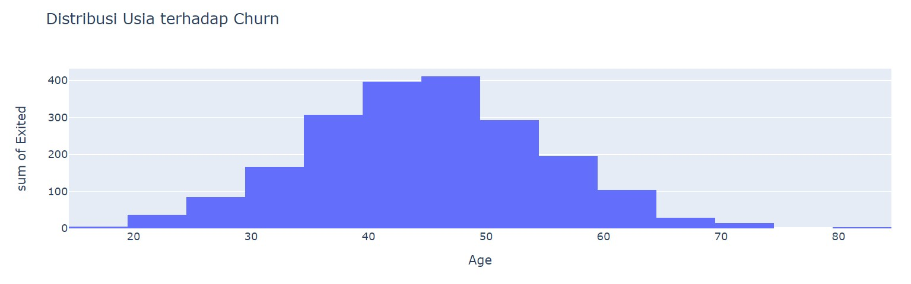

**Hasil analisis :** Usia **memiliki pengaruh** terhadap churn, hal ini dapat dilihat dari distribusi normal pada age atau usia, dengan nasabah yang melakukan exit atau churn umumnya memiliki jangkauan usia 40-49 tahun


**#Membuat plot distribusi Balance terhadap tingkat churn**
```code
fig2 = px.histogram(data, x="Balance", y='Exited', nbins=30, title="Distribusi Balance terhadap Churn")
fig2.show()
```

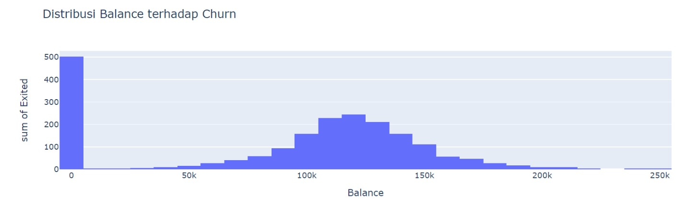

**Hasil analisis :** Balance **memiliki pengaruh** terhadap churn, hal ini dapat dilihat dari distribusi normal pada Balance, dengan nasabah yang melakukan exit atau churn umumnya memiliki jangkauan balance 0

**#Membuat plot distribusi ActiveMember terhadap tingkat churn**
```code
fig3 = px.histogram(data, x="IsActiveMember", y='Exited', title="Pengaruh Active member terhadap Churn")
fig3.show()
```

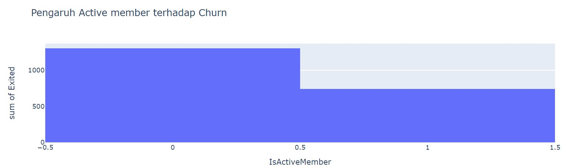

**Hasil analisis :** Jumlah active member **memiliki pengaruh** terhadap churn, hal ini dapat dilihat dari nasabah yang melakukan exit atau churn umumnya bukan member aktif

**#Membuat plot distribusi Tenure terhadap tingkat churn**
```code
fig4 = px.histogram(data, x="Tenure", y='Exited', nbins=30, title="Distribusi Tenure terhadap Churn")
fig4.show()
```

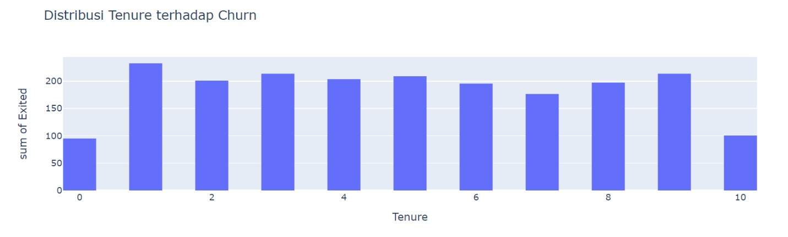

**Hasil analisis :** Tenure atau masa nasabah menggunakan layanan bank **tidak memiliki pengaruh** terhadap churn, hal ini dapat dilihat dari distribusi yang hampir merata pada setiap jangkauan tenure

**#Membuat plot distribusi Credit Score terhadap tingkat churn**
```code
fig5 = px.histogram(data, x="CreditScore ", y='Exited', title="Distribusi CreditScore terhadap Churn")
fig5.show()
```

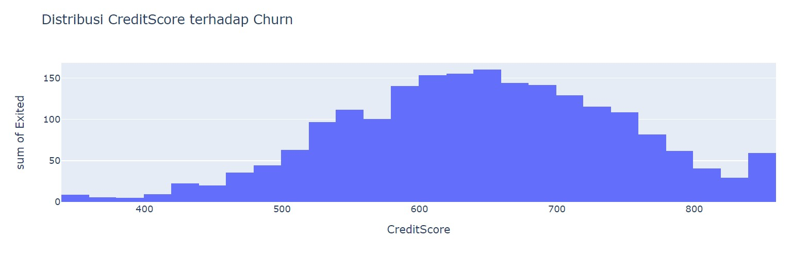

**Hasil analisis :** Credit score **memiliki pengaruh** terhadap churn, hal ini dapat dilihat dari distribusi normal pada creditscore, dengan **nasabah yang melakukan exit atau churn memiliki jangkauan credit score 580-699**

**#Membuat plot distribusi kepemilikan CreditCard terhadap tingkat churn**
```code
fig6 = px.histogram(data, x="HasCrCard", y='Exited', title="Pengaruh HasCrCard terhadap Churn")
fig6.show()
```

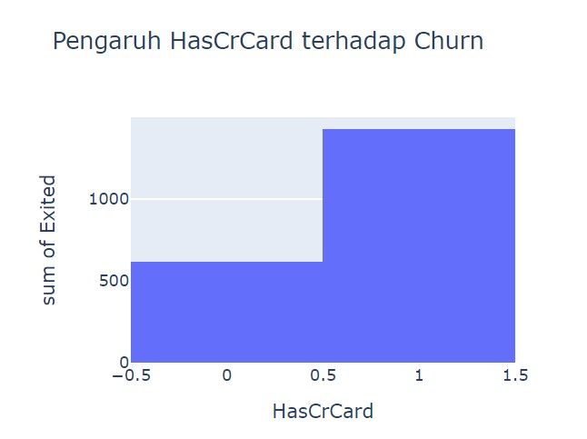

**Hasil analisis :** HasCrCard atau kepemilikan kartu kredit **memiliki pengaruh signifikan** terhadap churn, hal ini dapat dilihat dari kecenderungan nasabah yang memiliki kartu kredit untuk melakukan churn

**#Membuat plot distribusi Gender terhadap tingkat churn**
```code
fig7 = px.histogram(data, x="Gender", y='Exited', title="Pengaruh Gender terhadap Churn")
fig7.show()
```


**Hasil analisis :** Gender atau jenis kelamin **memiliki pengaruh** terhadap churn, hal ini dapat dilihat dari distribusi gender wanita atau Female yang memiliki jumlah exit lebih tinggi dibanding pria. Hal ini dapat dilihat bahwa wanita memiliki kecenderungan untuk churn lebih tinggi dibandingkan dengan pria.


**#Membuat plot distribusi Geography terhadap tingkat churn**
```code
fig8 = px.histogram(data, x="Geography", y='Exited', title="Distribusi Geography terhadap Churn")
fig8.show()
```

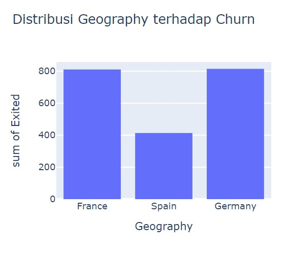

**Hasil analisis :** Geography atau negara asal nasabah **tidak memiliki pengaruh** terhadap churn, hal ini dapat dilihat dari distribusi yang hampir tidak berbeda signifikan antar lokasi. Distribusi France & Germany berbeda signifikan dengan distribusi Spain

Berdasarkan dari berbagai figur plot, dari berbagai atribut, nasabah yang cenderung melakukan churn banyak berada di jangkauan sebagai berikut,

**Card Balance :** 0

**Age :** 40-49

**Member :** Not Active Member

**CreditCard :** has credit card

**Credit score :** 580-699

**Gender :** Female

**Geography :** France or Germany


**Rekomendasi bisnis :**  menawarkan program benefit loyalitas bagi nasabah dengan kartu kredit dan memiliki credit score 600-800, sehingga nasabah terpacu untuk mempertahankan loyalitas nasabah yang memiliki credit score pada range tersebut. Solusi lainnya yaitu menyebarkan survey kepuasan pelanggan, sehingga diperoleh permasalahan yang dapat menyebabkan ketidakpuasan pelanggan (yang menyebabkan card balance 0 dan tidak aktif)


